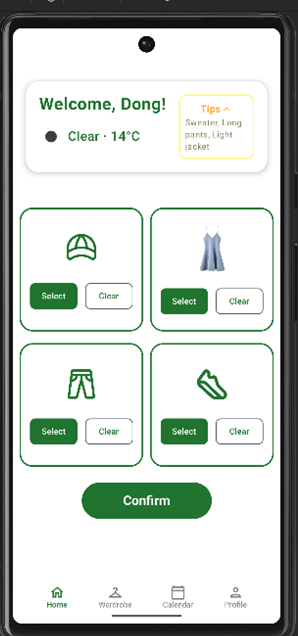
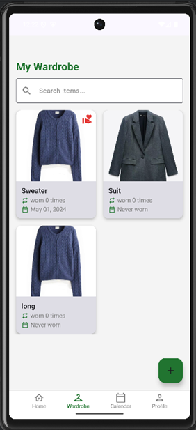
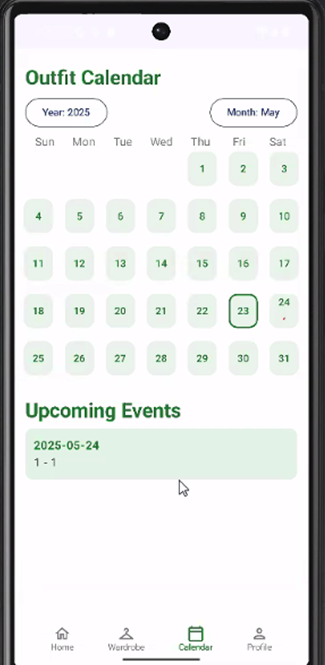
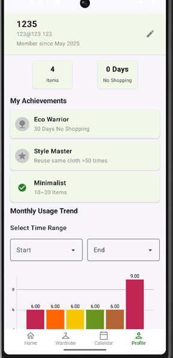

# EcoFit — Climate-smart Wardrobe Android App (Kotlin + Firebase/Room/Retrofit)

EcoFit helps users build sustainable wardrobe habits: track wears, receive donation nudges for unworn items, and plan outfits with local weather context.

## My Role & Contributions
- **Data layer owner**: designed Room **entities** and **DAOs**; implemented DB operations (insert, delete, update, queries).
- **Wardrobe screen**: UI + logic for item display, **search**, **add/edit/delete** clothes, and basic attributes/images management.

## Tech Stack
- **Android**: Kotlin, **Jetpack Compose**
- **Data**: **Room** (local DB), **Firebase Auth/DB**
- **Integration**: **Retrofit** (weather), **WorkManager** (notifications)

## Key Features (selected)
- Wardrobe management (images/attributes), quick search & CRUD
- Weather-aware outfit suggestions (rule-based) and calendar planning
- Wear-tracking with monthly reuse trend visualisation (box chart)
- Donation reminders for long-unworn items; profile dashboard with badges/titles

## Screenshots
- 
- 
- 
- 

## How to Run (local)
- This app is **not publicly hosted**.  
- Clone the **team repository (read-only)**: https://github.com/gbjdyyds/fit5046-A4  
- Open in **Android Studio**, sync Gradle, run on emulator or Android device.

## Lessons & Notes
- Clear separation of data layer (Room) simplified UI iteration
- Compose + WorkManager combo worked well for an app with periodic reminders

## Attribution
- Team project at Monash University.  
- **Original repository (team)**: https://github.com/gbjdyyds/fit5046-A4  
- This case study contains **write-up and images only**; code remains with the team.
