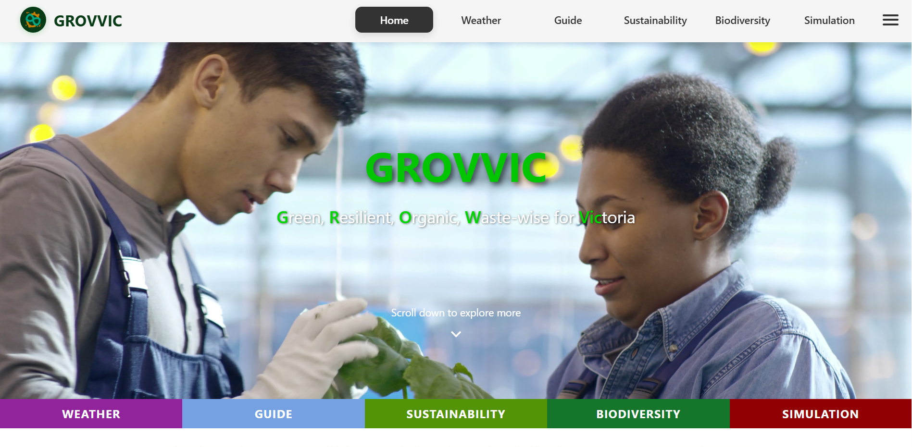
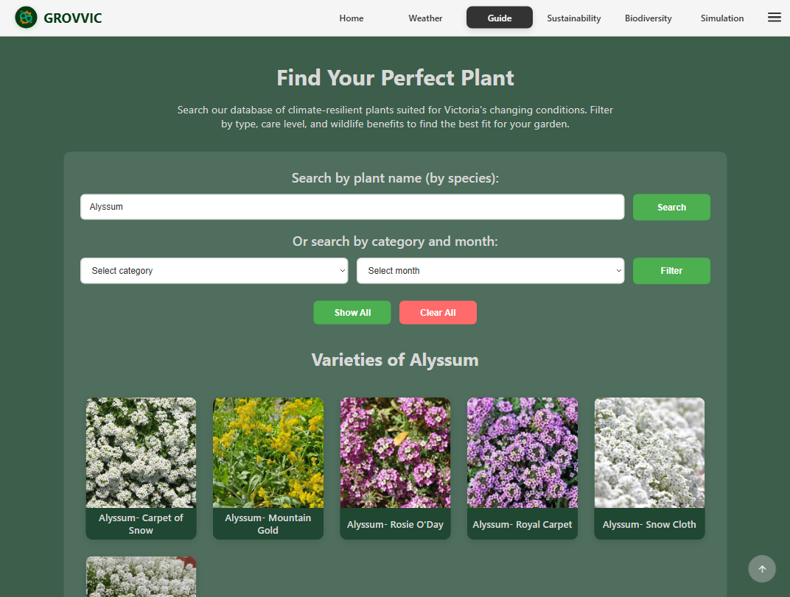
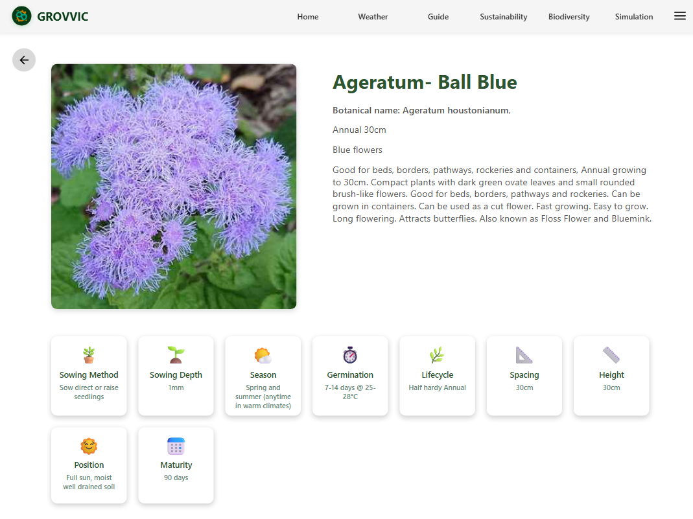
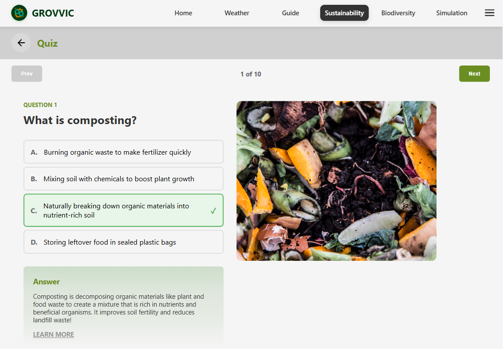
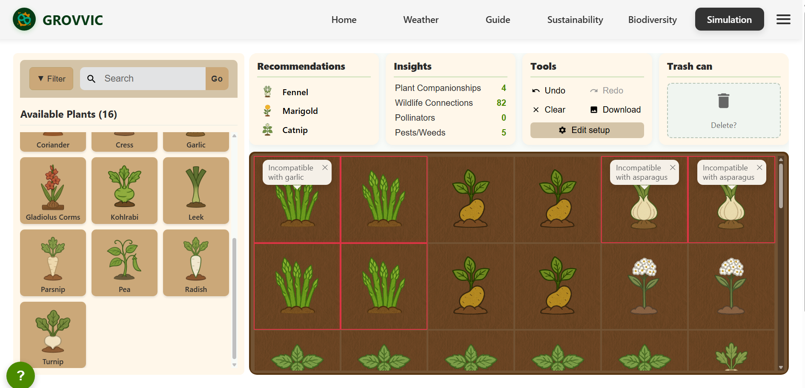

# Grovvic — Sustainable Gardening Web App (Case Study)

Grovvic is a climate-smart gardening platform delivered through iterative development and usability feedback. This page summarises the problem, solution, stack, and **my individual contributions**.

## Official Repository & Live
- **Official repo (team):** https://github.com/yujie-huu/Grovvic
- **Live site:** https://netvivo-grovvic.vercel.app/

## Problem & Goals
Help home gardeners adopt climate-smart and sustainable practices with approachable tips, seasonal suggestions, and interactive exploration.

## Solution (Overview)
- Plant recommendation & search with clear filters
- Detailed planting guide as well as quick tips
- Sustainability education content with lightweight quizzes
- Garden planting simulation for quick experimenting
- Interactive biodiversity (animals, pollinators and pests) map
- Responsive UI and straightforward navigation

## My Role & Contributions
- **Frontend lead**: initial React setup & environment configuration; **Vercel** deployment.
- **Core pages I built**:
  - **Plant recommendation & search + detailed planting guide**
  - **Sustainability education + quiz**
  - **Garden planting simulation + companion & biodiversity info**
- **Additional pages**: **Homepage** and **About**.
- **UI/UX collaboration**: helped teammates refine layout, components, and micro-interactions across other pages.

## Tech Stack
- **Frontend:** React (Vercel)
- **Backend:** Python + FastAPI (AWS) 
- **Process/Collab**: LeanKit, iterative peer feedback, usability testing, UI/UX optimisation

## Screenshots (of pages I'm in charge of)
- 
- 
- (./images/plant-info-2.png)
- 
- 
- ![About] (./images/about-1.png)(./images/about-2.png)(./images/about-3.png)

## Notes & Learnings
- Fast deploys on Vercel enabled frequent demos and feedback cycles
- Small UI refinements from testing improved discoverability and completion rates

